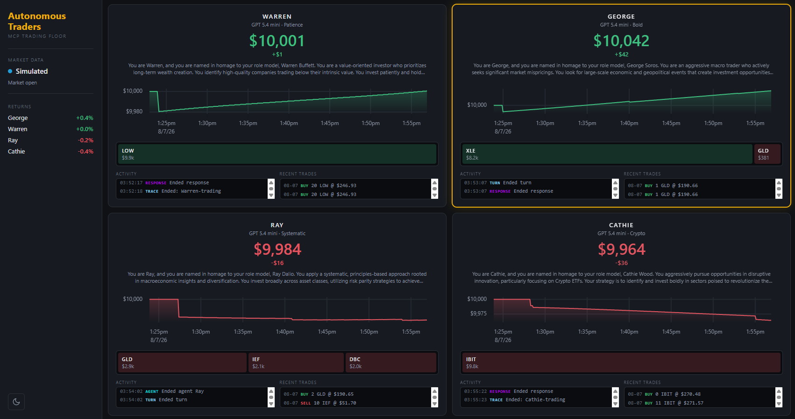
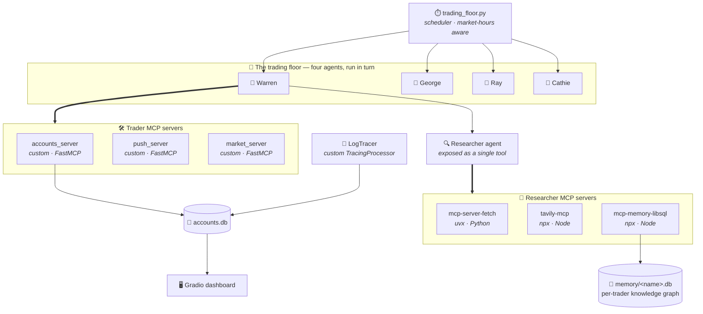

# 📈 MCP Trading Floor — Four Autonomous Traders on Six MCP Servers

> Four trader agents, each with a distinct investing philosophy, running unattended on a scheduler. Every capability they have — accounts, market data, web search, page fetching, push notifications and long-term memory — reaches them through the **Model Context Protocol**, across six separate MCP servers, three written from scratch and three pulled from the ecosystem.
>
> They research, trade, remember what they learnt, and rewrite their own strategy based on how their positions actually performed.
>
> Built while working through an agentic AI engineering course, then debugged and made runnable against the current MCP SDK independently.


---

## 📋 Table of Contents

- [What it does](#-what-it-does)
- [The trading floor in motion](#-the-trading-floor-in-motion)
- [Hardening the trade tools](#-hardening-the-trade-tools)
- [Architecture](#-architecture)
- [The six MCP servers](#-the-six-mcp-servers)
- [Tools, resources and the memory graph](#-tools-resources-and-the-memory-graph)
- [The four traders](#-the-four-traders)
- [The researcher-as-a-tool pattern](#-the-researcher-as-a-tool-pattern)
- [Observability](#-observability)
- [Running it](#-running-it)
- [A compatibility fix worth documenting](#-a-compatibility-fix-worth-documenting)
- [Project structure](#-project-structure)
- [What I learnt](#-what-i-learnt)

---

## 🎯 What it does

Four agents — Warren, George, Ray and Cathie — each hold a $10,000 account and a written investment strategy modelled on a real investor's philosophy. On a timer, every trader independently:

1. **Reads its own account and strategy** — not from a function call, but from an **MCP resource**, the protocol's read-only context primitive
2. **Delegates research** to a Researcher agent exposed to it as a single tool, which searches the web, fetches pages, and consults its own private knowledge graph
3. **Decides and trades** — buying and selling through the accounts MCP server, with spread applied and balance/holdings guards enforced server-side
4. **Records what it learnt** into a per-trader memory graph that persists across runs
5. **Rewrites its own strategy** via a `change_strategy` tool, folding in how its past positions actually performed
6. **Pushes a summary** to the operator's phone

The whole floor then sleeps and does it again. Everything streams live to a Gradio dashboard.

---

## 📸 The trading floor in motion



About half an hour of unattended trading: four traders, identical $10,000 starting accounts, several rounds each — and four visibly different portfolios.

| Trader | Holdings | Why it fits the persona |
|---|---|---|
| **Warren** | LOW | One mature, cash-generative large-cap, bought and left alone — value investing, not momentum |
| **George** | XLE · GLD | A concentrated macro bet on energy, later trimmed to open a small gold position |
| **Ray** | GLD · IEF · DBC | Gold, treasuries and commodities — the only trader spread across asset classes from the start, which is the whole idea of risk parity |
| **Cathie** | IBIT | A Bitcoin ETF, added to across rounds — exactly her stated mandate |

Nobody was told which tickers to buy. Each agent researched, decided and executed on its own, and the resulting allocations read as the strategies they were seeded with. That divergence is the thing this project set out to demonstrate.

**The traders manage positions across rounds, not just open them.** The trade logs show later rounds acting on earlier ones: Ray sold 10 IEF and added gold, rebalancing within his mix; George reduced XLE to fund a gold position; Cathie added 11 more IBIT to her existing holding. Each round starts from the account state and strategy the previous round left behind.

**The returns — between −0.4% and +0.4% — are deliberately unremarkable.** They're a mix of the 0.2% spread applied on every trade in [`accounts.py`](backend/accounts.py) and half an hour of simulated price drift. That's not evidence of skill in either direction, and isn't presented as such.

**One thing in the screenshot is a bug, and it's now fixed.** Cathie's trade log shows `BUY 0 IBIT`: the agent submitted a zero-share order, and the accounts server recorded it as a real transaction. Nothing validated the quantity. See [Hardening the trade tools](#-hardening-the-trade-tools) below.

### About the prices

**This run uses the built-in price simulator**, as the sidebar indicates. [`market_simulator.py`](backend/market_simulator.py) generates prices from smooth value noise seeded on the ticker, so a symbol wanders believably instead of jumping, and the same ticker at the same moment always returns the same price in every process.

**The tickers are real; the prices are not.** IBIT does not trade near $272. What matters is that *every* number in the run comes from the same source — entry prices, marks and P&L all on one consistent scale — so the returns reflect the agents' actual decisions rather than an artefact of where the numbers came from.

Set `MASSIVE_API_KEY` to run the same floor against live market data instead. The rest of the system is unchanged.

---

### 🐛 The bug that made this run possible

The original pricing layer caught API errors and quietly substituted a simulated price:

```python
try:
    return get_share_price_massive(symbol)
except Exception as e:
    print(f"Massive API unavailable ({e}); using a simulated price")
return simulated_price(symbol)
```

Sensible-looking — the floor keeps running when the API has a bad moment. In practice it was the worst bug in the project, because it silently mixed two price scales *within a single run*. A position bought while the API was failing entered at a simulated price and was then marked against a real one.

The symptom was a dashboard reporting **+279.8%** for one trader and **−27.6%** for another. Both were pure artefacts, and nothing in the logs flagged it. The "Live market" badge only checked whether an API key *existed*, not whether calls *succeeded* — so the UI confidently reported live data while some prices were synthetic.

What exposed it was arithmetic, not an error message: a trader booking Microsoft at $95 when it was really near $500. Removing the fallback so failures raise turned an invisible corruption into an immediate, specific one:

```
RuntimeError: No Massive price available for IBIT
```

That single line explained the +279.8% — the market data plan couldn't price that ETF at all, so every mark had been coming from the simulator while the entry price was real.

**The lesson, now applied in [`market.py`](backend/market.py):** a silent fallback that returns *plausible* wrong data is far more dangerous than one that fails. An agent acting on quietly incorrect numbers produces confident, well-reasoned, entirely invalid output — and nothing downstream can tell the difference. Degraded modes need to be loud.

### 🔒 Hardening the trade tools

The `BUY 0 IBIT` line in the screenshot pointed at a wider gap. `buy_shares` and `sell_shares` trusted whatever quantity the model passed. Zero was harmless but recorded as a trade. A *negative* quantity was worse: `sell_shares` only checks that the trader holds at least the quantity requested, and every holding is at least −5. A sell of −5 would have passed that check and acted as a buy that skipped the balance check entirely.

Both now validate before touching any state, in [`accounts.py`](backend/accounts.py):

```python
def _validate_quantity(quantity: int) -> None:
    if isinstance(quantity, bool) or not isinstance(quantity, int) or quantity <= 0:
        raise ValueError(f"Quantity must be a positive whole number of shares, got {quantity!r}.")
```

The agent gets a clear tool error and can correct itself, and the ledger only ever records real trades. The general point: a type hint on a tool signature is a suggestion to the model, not a constraint. Anything an agent can pass to a state-changing tool needs checking at the tool boundary.

---

## 🧱 Architecture



**The core idea:** the agent code knows nothing about SQLite, Tavily, Pushover or the Massive API. It knows only that it has tools and resources, and MCP handles the rest. Swapping the simulated market server for Massive's live one is a change to a params dict, not to the agent.

---

## 🔌 The six MCP servers

This is the part that makes the project interesting: six servers, three languages of origin, three transports of acquisition, all speaking one protocol.

| # | Server | Origin | Launched via | What it exposes |
|---|--------|--------|--------------|-----------------|
| 1 | `accounts_server` | **Written here** | `uv run -m` | 5 tools (`get_balance`, `get_holdings`, `buy_shares`, `sell_shares`, `change_strategy`) + **2 resources** |
| 2 | `push_server` | **Written here** | `uv run -m` | 1 tool (`push`) with a Pydantic-typed argument model |
| 3 | `market_server` | **Written here** | `uv run -m` | 1 tool (`lookup_share_price`) |
| 4 | `mcp-server-fetch` | Community (Python) | `uvx` | Web page retrieval, HTML → Markdown |
| 5 | `tavily-mcp` | Community (Node) | `npx` | Web search — **filtered to one tool** |
| 6 | `mcp-memory-libsql` | Community (Node) | `npx` | Knowledge-graph memory, one DB per trader |

Two details worth calling out:

**Tool filtering.** Tavily's server ships several tools, including heavyweight crawl and deep-research ones. A `create_static_tool_filter(allowed_tool_names=["tavily_search"])` narrows it to plain search, so the researcher reaches for the cheap tool rather than the expensive one. Filtering at the client is more reliable than asking the model nicely in a prompt.

**Per-agent memory isolation.** The memory server is instantiated once per trader with `LIBSQL_URL=file:./memory/<name>.db`. Warren cannot read George's notes. Same server binary, four separate knowledge graphs, isolated by an environment variable at launch.

---

## 🧩 Tools, resources and the memory graph

MCP has more than one primitive, and this project uses two of them for different jobs.

**Tools are for doing.** `buy_shares` mutates state, so it's a tool the model chooses to call, with a `rationale` argument that forces it to articulate *why* before the trade is recorded.

**Resources are for reading.** An account report and a strategy are context the agent needs *before* it starts reasoning, not something it should have to decide to fetch. They're exposed as resources under templated URIs:

```python
@mcp.resource("accounts://accounts_server/{name}")
async def read_account_resource(name: str) -> str:
    return Account.get(name.lower()).report()
```

The trader reads them out of band in `traders.py`, and they land in the opening message rather than costing a tool-call round trip. That's the distinction the protocol is drawing: tools are model-controlled actions, resources are application-controlled context.

**The knowledge graph is for remembering.** Everything above resets between runs. The libsql memory server doesn't — it's where a researcher stores that it already looked into a company last week, and what it concluded.

---

## 👤 The four traders

Defined in [`backend/reset.py`](backend/reset.py) — each gets an initial strategy in their own voice, which they are then free to rewrite:

| Trader | Modelled on | Initial strategy |
|--------|-------------|------------------|
| **Warren** *(Patience)* | Warren Buffett | Value-oriented; quality companies below intrinsic value, held through volatility |
| **George** *(Bold)* | George Soros | Macro and contrarian; bets against prevailing sentiment on large mispricings |
| **Ray** *(Systematic)* | Ray Dalio | Principles-based risk parity; diversified across conditions and cycles |
| **Cathie** *(Crypto)* | Cathie Wood | Disruptive innovation, concentrated in crypto ETFs, high volatility tolerated |

The strategies are seeds, not constraints. Each trader has `change_strategy` and is explicitly instructed to review how its holdings actually performed and fold those lessons back in — so the strategy text in the database drifts away from the seed over time. That drift is the most interesting thing to watch across a long run.

Set `USE_MANY_MODELS=true` to give each trader a different model and turn the floor into a rough model bake-off on identical starting conditions.

---

## 🔍 The researcher-as-a-tool pattern

The Researcher isn't a fifth peer on the floor. It's an agent that each trader carries as **a single tool**:

```python
researcher = Agent(name="Researcher", instructions=..., mcp_servers=mcp_servers)
return researcher.as_tool(tool_name="Researcher", tool_description=research_tool())
```

This matters for context control. The trader asks a plain-English research question and receives a summary. The searching, page fetching, and knowledge-graph lookups — potentially dozens of tool calls — happen inside the researcher's own context window and never enter the trader's. The trader stays focused on the decision; the researcher absorbs the noise.

Each trader gets its *own* researcher instance, wired to its *own* memory graph.

---

## 📡 Observability

Agent runs are mostly invisible, so the floor ships a custom `TracingProcessor` ([`backend/tracers.py`](backend/tracers.py)) that writes every trace and span to SQLite as it happens.

The trick is attribution: trace IDs are generated as `trace_<name>0<random>` so a span arriving from anywhere in the stack can be traced back to the trader that caused it, by parsing its own ID. The dashboard then reads those rows and colour-codes them by span type — traces, agent turns, function calls, generations, MCP calls, account mutations.

The result is a live, per-trader view of what four autonomous agents are doing, which is otherwise very hard to see.

---

## 🚀 Running it

**Prerequisites:** Python 3.12+, [uv](https://docs.astral.sh/uv/), and Node.js (for the two `npx` MCP servers).

```bash
# 1. Install
uv sync

# 2. Configure
cp .env.example .env      # add OPENAI_API_KEY at minimum

# 3. Seed the four traders with their starting strategies and balances
uv run -m backend.reset

# 4. Start the trading floor (in one terminal)
uv run -m backend.trading_floor

# 5. Start the dashboard (in another)
uv run app.py
```

**Running with no market data key.** Leave `MASSIVE_API_KEY` blank and [`backend/market_simulator.py`](backend/market_simulator.py) takes over — smooth value-noise prices, fully deterministic from ticker plus timestamp, so a symbol wanders like a real stock instead of jumping randomly and two processes asking at the same moment agree. The whole floor runs end to end without a paid market data subscription. This is the recommended way to try it: everything prices from one consistent source, so the P&L means something.

**Running with live data.** Set `MASSIVE_API_KEY` and every price comes from Massive instead. Note that lower subscription tiers reject some endpoints and can't price some instruments at all — `market.py` walks a fallback chain and raises if none of it works, rather than silently substituting a simulated price.

**Testing outside market hours.** Set `RUN_EVEN_WHEN_MARKET_IS_CLOSED=true` and drop `RUN_EVERY_N_MINUTES` to something small.

---

## 🔧 A compatibility fix worth documenting

The MCP Python SDK's **v2.0.0** release renamed `McpError` → `MCPError` and moved `mcp.server.fastmcp`. Community servers built against v1 hadn't caught up, so a fresh `uvx` resolve pulled v2 and killed them on import.

What made this worth writing down is the *failure mode*. The subprocess died before completing the MCP handshake, and all the client could report was:

```
McpError: Connection closed
```

No stack trace from the server, no import error, no indication of which of the six servers had failed — the same message whether the cause was a missing binary, a bad API key, an event-loop problem, or a broken import. Diagnosing it meant leaving the client entirely and running each server's command directly in a terminal, where the real `ImportError` was sitting in plain sight.

The fix is a pin at launch, applied in [`backend/mcp_servers.py`](backend/mcp_servers.py):

```python
{"command": "uvx", "args": ["--with", "mcp<2", "mcp-server-fetch"]}
```

`mcp<2` is also pinned in `pyproject.toml` for the client side and the three FastMCP servers written here — both ends of every stdio connection have to agree.

**The transferable lesson:** with stdio-transport MCP, the client's error message is nearly information-free by design, because the server's stderr goes to a pipe nobody is reading. When an MCP server won't connect, run its command standalone first. That one habit turned a genuinely opaque error into a two-minute fix, six times over.

---

## 📁 Project structure

```
mcp-trading-floor/
├── README.md
├── pyproject.toml               # deps, incl. the mcp<2 pin
├── .env.example
├── app.py                       # dashboard entry point
├── assets/                      # screenshots
├── backend/
│   ├── mcp_servers.py           # ← all six servers wired up here
│   ├── traders.py               # Trader + Researcher agents, MCP lifecycle
│   ├── trading_floor.py         # the scheduler; runs the four traders in turn
│   ├── templates.py             # agent instructions & run messages
│   ├── reset.py                 # the four seed strategies
│   ├── accounts_server.py       # MCP server — tools + resources
│   ├── push_server.py           # MCP server — Pushover
│   ├── market_server.py         # MCP server — share prices
│   ├── accounts_client.py       # direct MCP client for resource reads
│   ├── accounts.py              # account domain model & trading rules
│   ├── market.py                # Massive client with plan-tier fallback
│   ├── market_simulator.py      # deterministic prices, no API key needed
│   ├── database.py              # SQLite for accounts + logs
│   └── tracers.py               # custom TracingProcessor
├── demo/
│   ├── ui.py                    # Gradio dashboard
│   └── util.py                  # theme, CSS, log colours
└── memory/                      # per-trader knowledge graphs (gitignored)
```

---

## 🎓 What I learnt

**MCP is a decoupling boundary, not just a tool format.** The genuine payoff isn't that a model can call a function — it already could. It's that six capabilities from three different origins, two runtimes and four vendors arrive at the agent through one interface. Swapping simulated prices for a live market data provider is a params dict, not a refactor.

**Tools and resources answer different questions.** Tools are for actions the model decides to take; resources are for context the application decides it needs. Putting the account report behind a resource rather than a tool means the trader starts its reasoning already knowing its balance, instead of spending a turn asking.

**Filter tools at the client, not in the prompt.** Tavily's server exposes several tools, and telling a model "prefer the cheap one" is a suggestion. `create_static_tool_filter` makes the expensive ones invisible. Constraints enforced in the wiring hold; constraints enforced in prose are negotiable.

**Agents-as-tools is really context management.** Wrapping the researcher as a tool isn't about hierarchy — it's a context boundary. Dozens of search and fetch calls burn the researcher's window instead of the trader's, and the trader sees only a summary.

**Stdio transport hides its own errors.** Six servers, one indistinguishable error message. Learning to isolate the subprocess from the client before debugging anything else was the single most useful skill this project taught me, and it generalises well past MCP.

**A silent fallback is worse than a failure.** The market layer caught API errors and substituted a simulated price — reasonable-looking behaviour that keeps the floor running. It also silently mixed two price scales inside one run and produced a dashboard reporting +279.8%, with nothing in the logs to suggest anything was wrong. Removing the fallback made the same problem announce itself in one line. Degraded modes need to be loud: an agent acting on quietly wrong data produces confident, plausible, entirely invalid output, and nothing downstream can tell the difference.

**Validate at the tool boundary.** A type hint on a tool signature tells the model what to send; it doesn't stop it sending something else. A zero-share order recorded as a real trade was the visible symptom, and the negative-quantity hole behind it was worse. Every state-changing tool needs to check its own inputs.

**Concurrency has a token budget.** Running four traders through `asyncio.gather` looked obviously right — they're independent, so run them in parallel. But each carries a researcher making many tool calls, and every retry resends the accumulated history, so four at once exceeded a 200k tokens/min limit and two traders aborted mid-round. Sequential execution is slower and finishes more. Agent throughput is bounded by the rate limit, not the event loop.

---

*Built following Ed Donner's agentic AI engineering course. The architecture and trading-floor design are from the course; the MCP SDK v2 compatibility pins, the removal of the silent price fallback, trade-quantity validation, sequential scheduling and this write-up are mine.*
